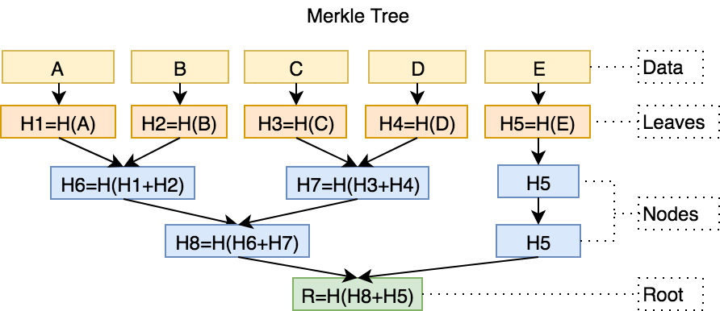

<h1 align="center">Merkle Tree in Golang</h1>
<p align="center">
<a href="https://travis-ci.org/cbergoon/merkletree"></a>
<a href="https://goreportcard.com/report/github.com/cbergoon/merkletree"></a>
<a href="https://godoc.org/github.com/cbergoon/merkletree"></a>
<a href="#"></a>
</p>

An implementation of a Merkle Tree written in Go. A Merkle Tree is a hash tree that provides an efficient way to verify
the contents of a set data are present and untampered with.

At its core, a Merkle Tree is a list of items representing the data that should be verified. Each of these items
is inserted into a leaf node and a tree of hashes is constructed bottom up using a hash of the nodes left and
right children's hashes. This means that the root node will effictively be a hash of all other nodes (hashes) in
the tree. This property allows the tree to be reproduced and thus verified by on the hash of the root node
of the tree. The benefit of the tree structure is verifying any single content entry in the tree will require only
nlog2(n) steps in the worst case.

#### Sample



#### Example Usage
Below is an example that makes use of the entire API - its quite small.
```go
package main

import (
	"fmt"
	"log"

	"github.com/ethereum/go-ethereum/common"
	solsha3 "github.com/miguelmota/go-solidity-sha3"
)

//Leaves implements the Content interface provided by merkletree and represents the content stored in the tree.
type Leaves struct {
	params []interface{}
	types  []string
}

//CalculateHash hashes the values of a TestContent
func (lv Leaves) CalculateHash() ([]byte, error) {
	res := solsha3.SoliditySHA3(lv.types, lv.params)
	return res, nil
}

//Equals tests for equality of two Contents
func (lv Leaves) Equals(other Content) (bool, error) {
	if len(lv.params) != len(other.(Leaves).params) {
		return false, nil
	}
	for k, v := range other.(Leaves).params {
		if v != lv.params[k] {
			return false, nil
		}
	}
	return true, nil
}

func main() {
	//Build list of Content to build tree
	var (
		leavess []Content
		types   = []string{"address", "uint256"}
	)
	leavess = append(
		leavess,
		Leaves{types: types, params: []interface{}{"0x5B38Da6a701c568545dCfcB03FcB875f56beddC4", "1000"}},
		Leaves{types: types, params: []interface{}{"0xd3dE9c47b917baAd93F68B2c0D6dEe857D20b015", "1000"}},
		Leaves{types: types, params: []interface{}{"0x7cD1CB03FAE64CBab525C3263DBeB821Afd64483", "1000"}},
	)
	//Create a new Merkle Tree from the list of Content
	tree, err := NewMerkleTree(leavess)
	if err != nil {
		log.Fatal(err)
	}

	//Get the Merkle Root of the tree
	merkleRoot := tree.GetMerkleRoot()
	fmt.Println(common.Bytes2Hex(merkleRoot))

	//Verify the entire tree (hashes for each node) is valid
	vt, err := tree.VerifyMerkleTree()
	if err != nil {
		log.Fatal(err)
	}
	log.Println("Verify Tree: ", vt)

	//Verify a specific content in in the tree
	vc, err := tree.VerifyProof(leavess[0])
	if err != nil {
		log.Fatal(err)
	}
	log.Println("Verify Content: ", vc)

	// Get leave
	tmp, _ := tree.GetMerkleProof(leavess[0])
	proof := make([]string, 0)
	for _, v := range tmp {
		proof = append(proof, common.Bytes2Hex(v))
	}
	fmt.Println(proof)

}

```

#### License
This project is licensed under the MIT License.
